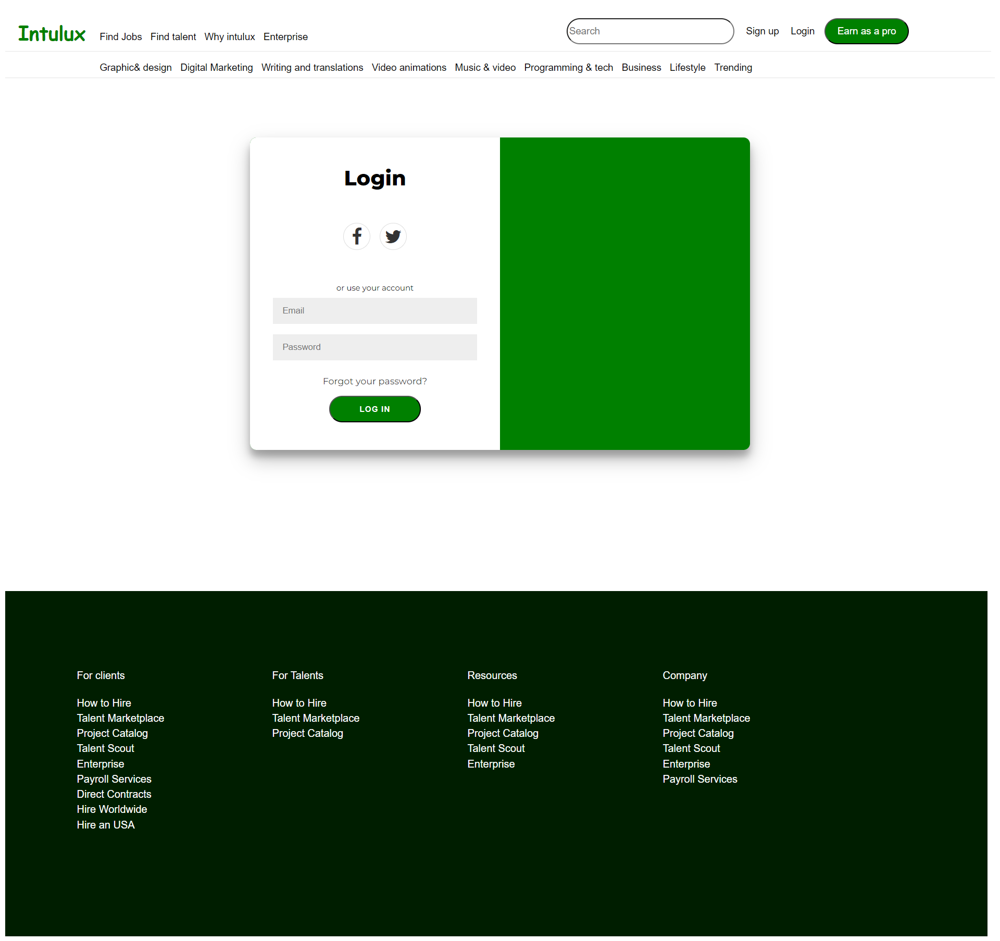

# INTULUX - E-commerce Website Clone

## [ALI HASSAN](https://linkedin.com/in/ali-hassan-08b306226)

## Overview

**INTULUX** is a fully-featured e-commerce website clone that showcases a seamless blend of modern UI/UX design, responsive layouts, and robust functionality using HTML, CSS, and JavaScript. This project mimics the functionality of a real-world e-commerce platform, providing a rich user experience with a clean, intuitive interface.

## Features

- **Responsive Design:** The website adapts to different screen sizes, offering a seamless experience on both desktop and mobile devices.
- **Modern UI/UX:** A visually appealing design with user-friendly navigation that enhances the overall user experience.
- **Interactive Elements:** Includes interactive features such as dynamic content loading, animations, and form validations.
- **Authentication:** User login and signup pages with basic authentication workflows.
- **Admin Panel:** A dedicated admin panel built with pure HTML and CSS for managing the website's content.
- **Category Pages:** Various category pages showcasing different talents and job opportunities.

## Technologies Used

- **HTML5:** For structuring the content of the web pages.
- **CSS3:** For styling the web pages and ensuring responsiveness across different devices.
- **JavaScript:** For adding interactivity and handling client-side logic.
- **React (Learning Stage):** Beginning to integrate React for more dynamic content management.
- **Node.js (Learning Stage):** Implementing server-side logic and handling API requests.

## Project Structure

- **assets/**: Contains all the images, icons, and other static assets used in the project.
- **userpanel/**: The admin panel built with pure HTML and CSS.
- **index.html**: The main landing page of the website.
- **login.html**: The login page for user authentication.
- **signup.html**: The signup page for new user registration.
- **intulux_enterprice.html**: Page dedicated to enterprise solutions.
- **all_jobs.html**: A page listing all available job categories.
- **talent_pages/**: Includes various HTML files for different talent categories like graphic design, programming, music, etc.

## Installation

To run this project locally:

1. Clone the repository:
   ```bash
   git clone https://github.com/JIN-15/INTULUX-ECommerce.git
   ```
2. Navigate to the project directory:
   ```bash
   cd INTULUX
   ```
3. Open the `index.html` file in your browser to view the website.

## Screenshots

Here are some screenshots of the project:

- **Home Page:**
  

- **Sign-in Page:**
  

- **Another Example Page:**
  

You can add more screenshots of other pages as needed by storing them in the `assets/` folder and linking them here.

## Usage

- **Home Page:** Explore various job categories, find talent, and browse available jobs.
- **Admin Panel:** Log in as an admin to manage the website's content (e.g., adding new job categories, updating talent profiles).
- **Signup/Login:** Users can create an account or log in to apply for jobs or post their own job listings.

## How to Contribute

Contributions are welcome! If you'd like to contribute, please follow these steps:

1. **Fork the repository:**
   Click on the "Fork" button at the top right corner of this repository page to create a copy of the repository under your GitHub account.

2. **Clone the repository:**

   ```bash
   git clone https://github.com/JIN-15/INTULUX-ECommerce.git
   ```

3. **Create a new branch:**

   ```bash
   git checkout -b feature/your-feature-name
   ```

   Replace `your-feature-name` with a descriptive name for your feature.

4. **Make your changes:**
   Add your changes or new features.

5. **Commit your changes:**

   ```bash
   git add .
   git commit -m "Add detailed description of your changes"
   ```

6. **Push your changes to the branch:**

   ```bash
   git push origin feature/your-feature-name
   ```

7. **Create a Pull Request:**
   Go to the original repository on GitHub and click on "Pull Requests" then "New Pull Request." Choose your branch and submit your pull request.

8. **Wait for review:**
   The project maintainers will review your pull request and provide feedback or merge it into the main branch.

## Contact

If you have any questions or suggestions, feel free to reach out via GitHub or email.
[ALI HASSAN](mailto:hassanakramali@gmail.com)
